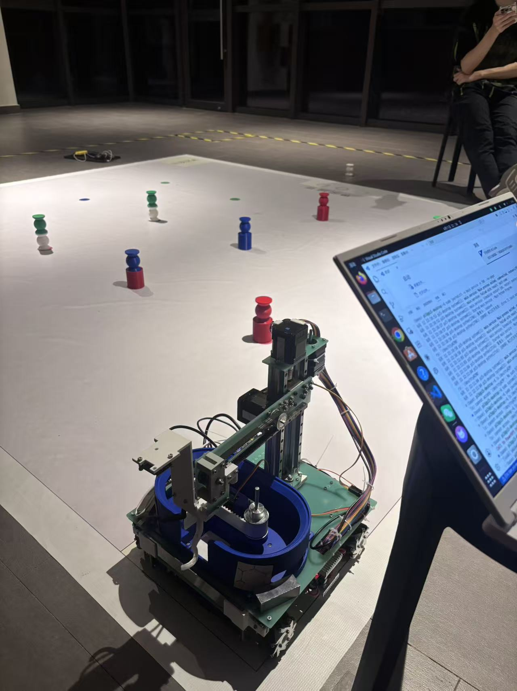
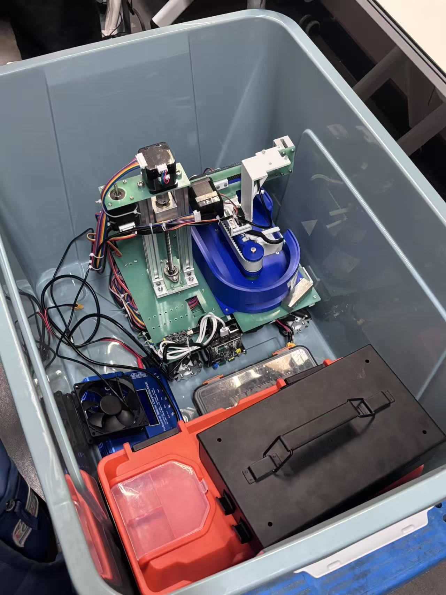
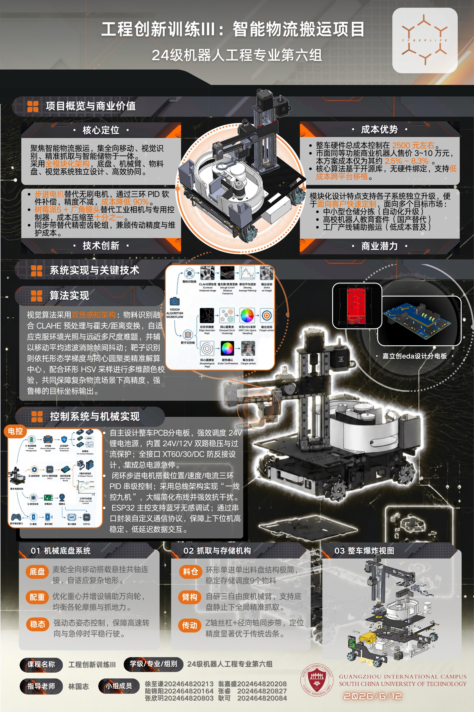

# Vision-Guided Intelligent Logistics Robot

An intelligent logistics robot developed for an engineering innovation course. The system combines omnidirectional movement, computer vision, robotic-arm control, and automated material storage for warehouse handling tasks.

## Key Features

- Raspberry Pi 5 vision system for object and target detection
- ESP32-based motion control and task coordination
- Three-axis robotic arm for automatic picking and placing
- Mecanum-wheel chassis for omnidirectional movement
- Rotary tray capable of storing and managing up to nine objects
- Custom serial protocol for communication between the Raspberry Pi and ESP32

## Tech Stack

**Embedded:** ESP32, Arduino, PlatformIO, C++  
**Vision:** Raspberry Pi 5, Python, OpenCV  
**Mechanical Design:** SolidWorks, 3D printing, laser-cut parts

## Repository Structure

- `Esp32_code/` - ESP32 firmware and control modules
- `Pi5_code/` - Computer vision and serial communication program
- `Structure/` - SolidWorks models and mechanical design files
- `Poster.pdf` - Full project poster

## Robot Photos

  
  

## Project Poster

